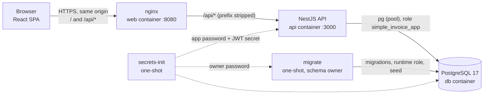
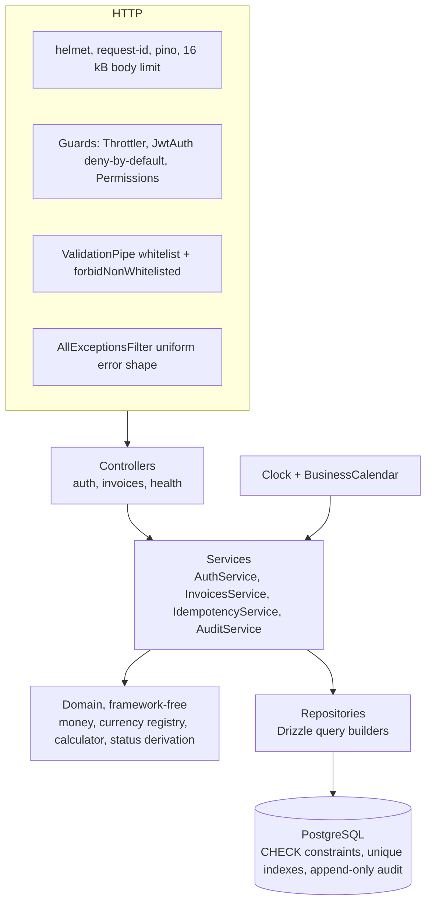
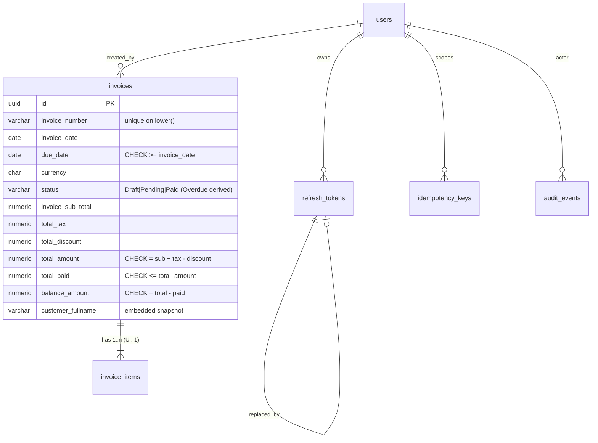
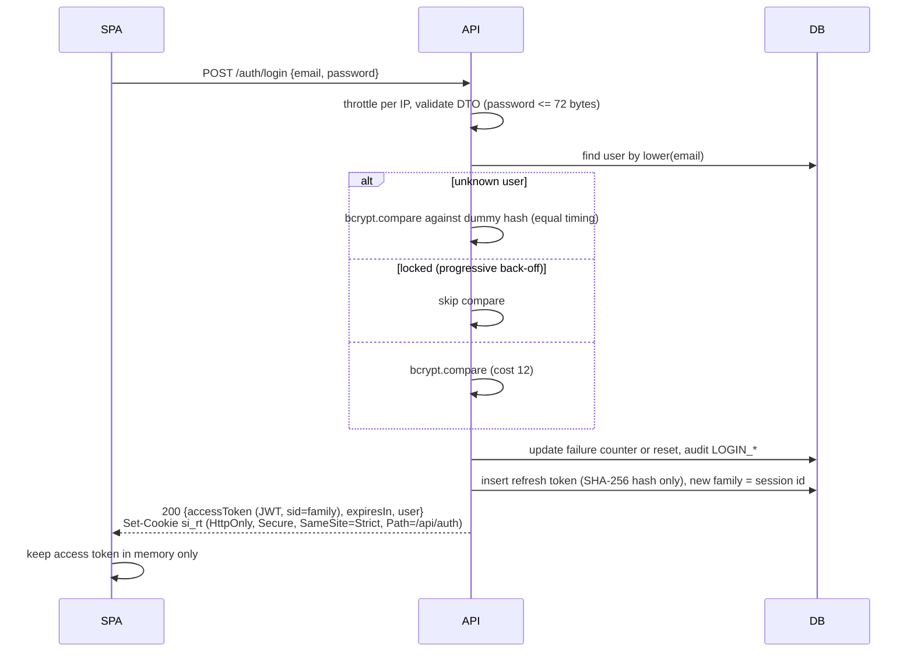
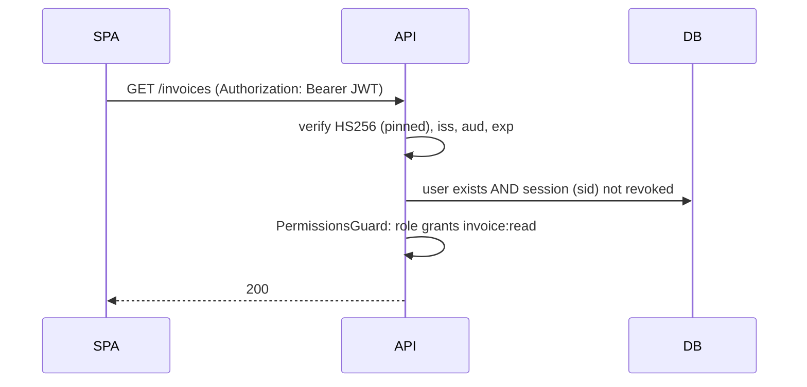

# SimpleInvoice: Architecture

Companion to `SPEC.md` (normative details). This document explains the shape of the system and the reasoning behind the security-relevant flows.

## 1. System context



- The browser only ever talks to one origin. nginx serves the SPA and reverse-proxies `/api/*` to the API, so the refresh cookie is first-party and CORS stays disabled.
- The API is stateless apart from PostgreSQL. It exposes exactly the routes in the assessment (`/auth/*`, `/invoices*`) plus `/health` and Swagger at `/api/docs`.
- Secrets are generated on first start and never committed. They sit in two volumes, so the API never sees the owner password.
- Only nginx has a host port (`127.0.0.1:8080`). The API connects to PostgreSQL as `simple_invoice_app`, a least-privilege role that cannot disable the audit trigger or drop constraints; the one-shot `migrate` job is the only user of the owner account (SPEC 11.4).

## 2. Backend layers



Design rules:

- Money and status logic live in `src/invoices/domain`, pure TypeScript with `decimal.js`, unit tested without Nest or a database.
- The database re-states every invariant as a CHECK constraint (totals formula, balance, no overpayment, due date, Paid means settled). The application is the first line of defense; the schema is the last.
- "today" comes from an injected clock evaluated in `BUSINESS_TIMEZONE`, which is the application's equivalent of a core-banking business date. It is passed to SQL as a bound parameter, never `CURRENT_DATE`.

## 3. Data model



Customer data is embedded on the invoice as a snapshot, because an issued invoice is a legal document whose recipient details must not change retroactively.

## 4. Authentication flows

### 4.1 Login



Every failure path returns the same `401 Invalid email or password`.

### 4.2 Authenticated request and immediate revocation



The session check turns logout and refresh-token theft detection into immediate access-token revocation, instead of waiting up to the 3600 s token lifetime.

### 4.3 Refresh with rotation and reuse detection

```mermaid
sequenceDiagram
  participant B as SPA
  participant A as API
  participant D as DB
  B->>A: POST /auth/refresh (cookie si_rt, X-Requested-With, Origin)
  A->>A: CSRF checks (custom header, Origin, Sec-Fetch-Site)
  A->>D: BEGIN; find token by hash; lock its family (advisory lock); SELECT token FOR UPDATE
  alt token already rotated or revoked (replay)
    A->>D: revoke whole family; audit REFRESH_TOKEN_REUSE_DETECTED
    A-->>B: 401 (all sessions of that family die, incl. the attacker's)
  else valid and family not past absolute lifetime
    A->>D: insert successor (same family), mark old replaced; COMMIT
    A-->>B: 200 new access token + rotated cookie
  end
```

Refresh, logout and reuse revoke all take the same per-family advisory lock first, so they run one at a time for one session: a logout can never miss a successor token that a refresh is creating at the same moment (DECISIONS D-59).

## 5. Creating an invoice (exactly-once)

```mermaid
sequenceDiagram
  participant B as SPA
  participant A as API
  participant D as DB
  B->>A: POST /invoices (Idempotency-Key: uuid) body
  A->>A: validate DTO, calculate totals with decimal.js (HALF_UP to currency minor units)
  A->>D: BEGIN; set transaction-local lock_timeout
  A->>D: INSERT idempotency key ON CONFLICT DO NOTHING
  alt key exists, same request hash
    A-->>B: replay stored 201 (Idempotent-Replayed: true)
  else key exists, different hash
    A-->>B: 422
  else new key
    A->>D: INSERT invoice + item (CHECK constraints re-verify totals)
    A->>D: INSERT audit INVOICE_CREATED
    A->>D: store response on key; COMMIT
    A-->>B: 201 Location /invoices/{id}
  end
```

A duplicate invoice number (case-insensitive unique index) surfaces as `23505` inside the transaction and is mapped to `409`. There is no check-then-insert race.

## 6. Frontend

Feature-Sliced Design v2.1: `app > pages > features > entities > shared`, downward imports only, enforced by Steiger.

- `shared/auth` owns the in-memory session and a single-flight refresh, so ten parallel 401s cause one refresh call.
- `shared/api` attaches the bearer token, retries once after refresh, and normalizes errors into one `ApiError` type.
- List filters live in the URL (shareable, back-button safe). Server state is managed by TanStack Query.
- The UI never calculates totals and never converts money to floating point. Amounts arrive as decimal strings and are rendered with `Intl.NumberFormat`.
